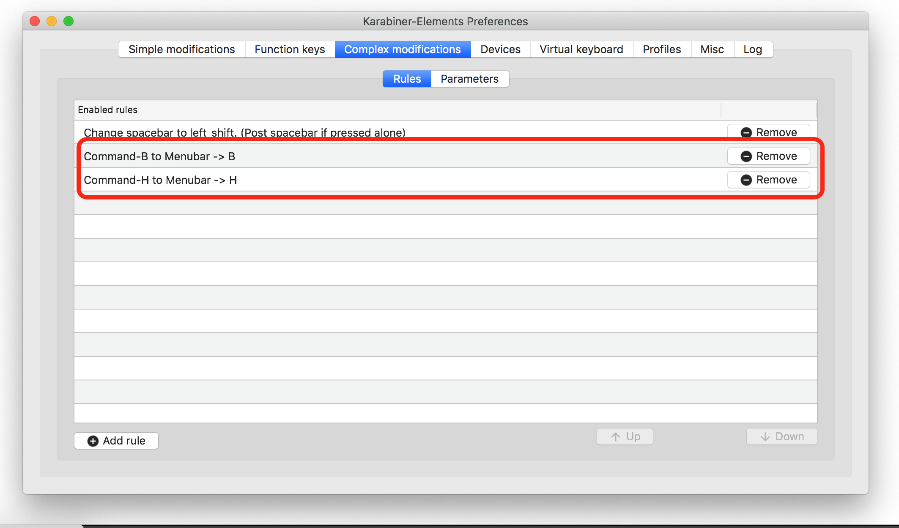
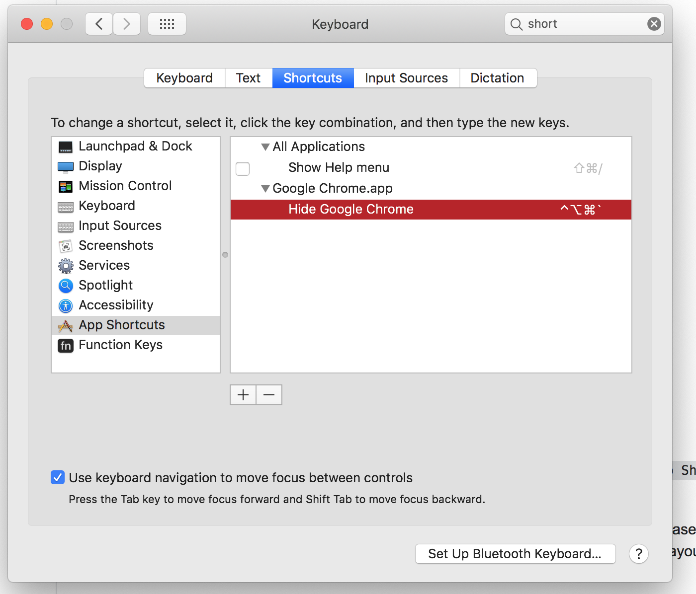

# Complex Modifications

## MenuBarAccessByKey

Windowsだとできるが、Macだとできない「メニューバーのBをAltと同時押しでアクセス」を実現します。

具体的なユースケースは、Google Chromeでブックマーク、履歴にアクセスしたい時です。

前提としてMacOS UIの言語を英語にしてある必要があります。(表示にBとかが必要なので)

### 制限

MacOSというより、各種アプリケーションのデフォルトのキーバインドとして `Command-H` が「アプリケーションウィンドウを隠す」というアクションに割り当てられてしまっており、そのままでは置き換えできません。

これを解消するには、[システム環境設定(Preference)の「キーボード>ショートカット」から同一名称のアクションに対して、使わないであろうキーコンビネーションを割り当てる](https://superuser.com/questions/1043596/mac-osx-remove-hide-window-keyboard-shortcut)必要があります。

下図の場合は ``Ctrl-Option-Command- ` `` という、まず使わないであろう組み合わせを指定しています。

なお、ひどい事に、この指定は **アプリケーションごとに全て** する必要があります。面倒。